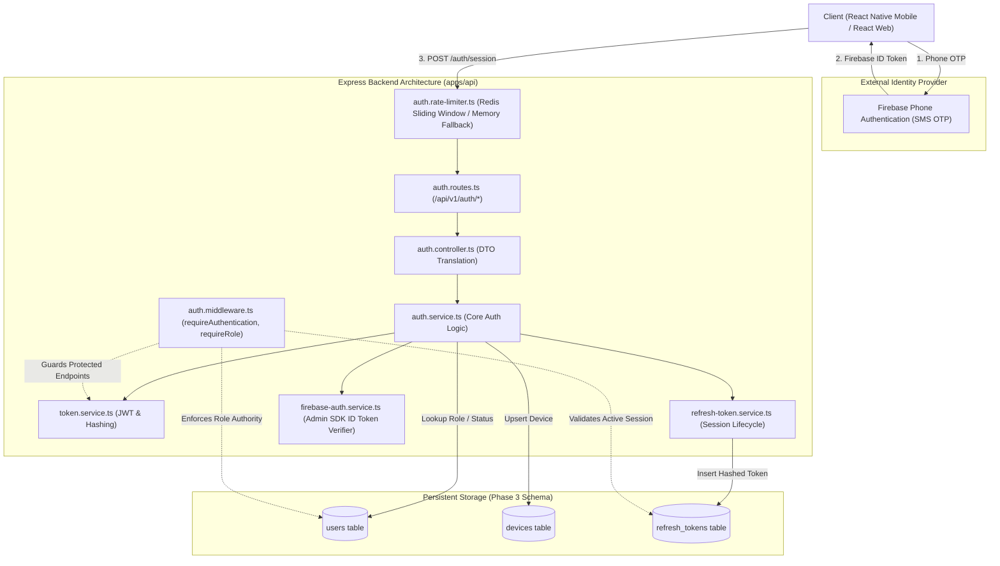
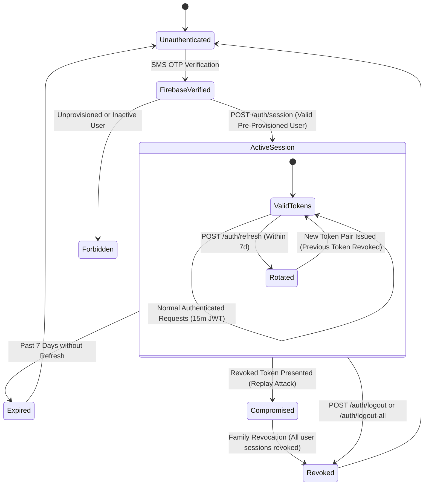

# MedFlow Architecture: Authentication, Session Management & RBAC

**Document Type:** Architectural Specification  
**Phase:** Phase 5 — Authentication, Session Management & Role-Based Access Control  
**Module:** Core Identity & Access Control Architecture  
**Status:** Approved Implementation Baseline  

---

## 1. Architectural Overview & Boundaries

Phase 5 establishes the security and session gateway for MedFlow. It sits directly behind the HTTP reverse proxy / load balancer and governs access to all versioned API routes (`/api/v1/*`) and future real-time WebSocket channels.



---

## 2. Token Lifecycle & Session State Machine



---

## 3. Database Model & Relationship Preservation

Phase 5 strictly utilizes the approved Phase 3 Prisma schema without modification:

1. **`users` Table:**
   - Authoritative source for `role` (`PARAMEDIC`, `TRIAGE_DOCTOR`, `HOSPITAL_SUPERINTENDENT`).
   - Validates account status via `status` (`ACTIVE`, `INACTIVE`, `SUSPENDED`) and `deletedAt`.
   - Links to external provider via unique `firebaseUid`.
2. **`devices` Table:**
   - Tracks client installation platform (`IOS`, `ANDROID`, `WEB`), application version (`appVersion`), and push notification tokens (`pushToken`).
   - Updates `lastActiveAt` upon session establishment and token rotation.
3. **`refresh_tokens` Table:**
   - Stores only `hashedToken` (`VarChar(128)` unique SHA-256 hash).
   - Foreign key `device_id` references `devices.id` with `onDelete: SetNull`.
   - Foreign key `user_id` references `users.id` with `onDelete: Cascade`.
   - Manages expiration (`expiresAt`) and revocation (`revokedAt`).

---

## 4. RBAC Authorization Pipeline

Protected endpoints utilize composable Express middleware functions:

```typescript
// Example: Paramedic Field Intake Endpoint
apiV1Router.post(
  '/patients',
  requireAuthentication,
  requireRole(UserRole.PARAMEDIC),
  patientController.createIntake
);

// Example: Triage Evaluation Endpoint
apiV1Router.post(
  '/triage',
  requireAuthentication,
  requireRoles([UserRole.PARAMEDIC, UserRole.TRIAGE_DOCTOR]),
  triageController.evaluate
);

// Example: Hospital Command Center Incident Management
apiV1Router.post(
  '/incidents',
  requireAuthentication,
  requireRole(UserRole.HOSPITAL_SUPERINTENDENT),
  incidentController.createIncident
);
```

### Execution Order:
1. `requireAuthentication`:
   - Validates format: `Authorization: Bearer <token>`.
   - Cryptographically verifies JWT signature and expiration using `TokenService`.
   - Verifies the underlying database session has not been revoked (`RefreshTokenService.isSessionActive`).
   - Fetches the user from PostgreSQL to verify active status and obtain their authoritative role.
   - Populates `req.auth` and `req.user`.
2. `requireRole(role)` / `requireRoles(roles)`:
   - Evaluates `req.auth.role`.
   - If unauthorized, immediately halts execution with HTTP 403 `AUTH_ROLE_REQUIRED`.

---

## 5. Architectural Compliance Matrix

| Rule | Requirement | Phase 5 Status | Implementation Evidence |
| :--- | :--- | :--- | :--- |
| **No Passwords** | Primary auth via phone OTP | COMPLETE | `FirebaseAuthService.verifyIdToken` |
| **Short-Lived Access** | 15-minute access JWT | COMPLETE | `TokenService.signAccessToken` (expiresIn: 900s) |
| **Hashed Persistence** | Refresh tokens never plaintext | COMPLETE | `TokenService.hashRefreshToken` (SHA-256) |
| **Replay Defense** | Reuse of revoked token triggers family revocation | COMPLETE | `RefreshTokenService.rotateRefreshToken` |
| **Zero Client Trust** | Role derived strictly from DB | COMPLETE | `AuthService.establishSession`, `requireAuthentication` |
| **Rate Limiting** | Auth endpoints abuse protection | COMPLETE | `createAuthRateLimiter` (Redis + In-memory fallback) |
| **Logging Redaction** | Blacklist auth headers & tokens | COMPLETE | `common/logging/logger.ts` redact rules |
| **Schema Integrity** | 18 tables preserved | COMPLETE | 0 changes to `prisma/schema.prisma` |
| **No Domain Logic** | No patient, triage, inventory domain code | COMPLETE | Isolated to `src/modules/auth/*` |
