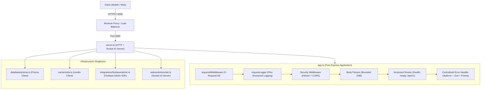
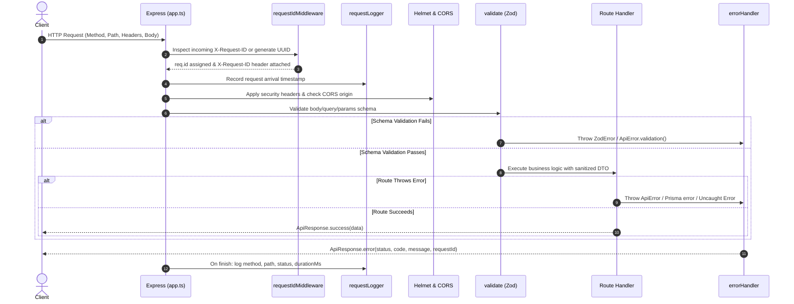

# MedFlow Backend Foundation & Infrastructure Architecture

**Document Type:** Technical Architecture Specification  
**Phase:** Phase 4 — Backend Foundation & Infrastructure  
**Module:** Core Application Engine (`apps/api`)  
**Status:** Approved Implementation Baseline

---

## 1. Architectural Overview & Separation of Concerns

MedFlow's backend is implemented using Node.js, Express, and TypeScript within an npm workspaces monorepo structure. The foundation enforces a strict architectural boundary between **Application Definition** (`src/app.ts`) and **Server Bootstrap / Infrastructure Runtime** (`src/server.ts`).

### Architectural Guarantees:
1. **Testability Without Port Binding**: `app.ts` exports the configured Express application without binding to a network port. This enables Supertest to execute fast, non-interfering HTTP test suites without socket collisions.
2. **Zero Inward Leakage**: Configuration and infrastructure clients are singleton modules. Domain and presentation layers never instantiate `new PrismaClient()` or `new Redis()`.
3. **Database Boundary Protection**: Clients never communicate directly with PostgreSQL or Redis Cloud. Express is the sole application-level gateway.

---

## 2. Infrastructure Lifecycle Management

### 2.1 Prisma PostgreSQL Client Lifecycle
* **Singleton Instance**: Maintained in `src/database/prisma.ts`. In development, hot-reloading reuses `globalThis.__medflow_prisma` to prevent exhausting PostgreSQL connection pools.
* **Connection Mode**: Connects using `DATABASE_URL` (Supabase transaction pooler with `?pgbouncer=true` for pooled application queries) and `DIRECT_URL` for session commands.
* **Lifecycle Hooks**:
  - `connectPrisma()`: Executed during server startup. Emits diagnostic log on success, catches and logs connection failures gracefully.
  - `disconnectPrisma()`: Executed during graceful shutdown. Disconnects cleanly.
  - `checkPrismaHealth()`: Runs `SELECT 1` to report live health status in `/ready`.

### 2.2 Redis Cloud Client Lifecycle
* **Client Implementation**: Managed via `ioredis` in `src/cache/redis.ts`.
* **Resilience Configuration**: Configured with `lazyConnect: true`, `enableOfflineQueue: false`, and exponential backoff retry strategies capped at 3 attempts in development.
* **Degraded Operation**: If Redis Cloud is unreachable during local startup, the backend logs a warning and proceeds, allowing non-cache development while accurately reporting `dependencies.redis = 'down'` in `/ready`.
* **Lifecycle Hooks**:
  - `connectRedis()`: Connects asynchronously on bootstrap.
  - `disconnectRedis()`: Quits or disconnects gracefully during shutdown.
  - `checkRedisHealth()`: Executes `redis.ping()` returning true if response is `PONG`.

### 2.3 Firebase Admin SDK Lifecycle
* **Singleton App**: Initialized in `src/integrations/firebase/admin.ts` using `admin.initializeApp()`.
* **Credential Security**: Reads `FIREBASE_PROJECT_ID`, `FIREBASE_CLIENT_EMAIL`, and `FIREBASE_PRIVATE_KEY` directly from validated configuration. Safely replaces literal escaped newlines (`\n`).
* **Health Check**: `checkFirebaseHealth()` validates initialization state.

### 2.4 Socket.IO Real-time Server Lifecycle
* **Server Binding**: Initialized in `src/websocket/socket.ts` and attached directly to Node's `http.Server`.
* **CORS Harmonization**: Inherits `config.corsOrigins` identical to HTTP endpoints.
* **Telemetry Logging**: Logs socket connections and disconnections with socket ID, client IP, and query parameters.
* **Clean Shutdown**: `closeSocketServer()` stops accepting incoming WebSocket connections and disconnects active sockets gracefully.

---

## 3. Request & Error Processing Pipeline

### 3.1 Centralized Error Mapping
The error handler (`src/common/errors/errorHandler.ts`) enforces safe serialization:
- **`ApiError`**: Serialized to JSON with its assigned HTTP status and machine-readable `code`.
- **`ZodError`**: Mapped to HTTP 400 `VALIDATION_ERROR` with structured field paths and error messages.
- **Prisma `P2002`**: Mapped to HTTP 409 `CONFLICT` without exposing table schemas.
- **Prisma `P2025`**: Mapped to HTTP 404 `NOT_FOUND`.
- **Prisma `P2003`**: Mapped to HTTP 400 `DATABASE_ERROR`.
- **Uncaught / Unknown Exceptions**: Logged with full stack trace and correlation ID server-side, returning a safe generic HTTP 500 `INTERNAL_ERROR` to the client. Stack traces and database connection strings are **never** returned in HTTP responses.

---

## 4. Graceful Shutdown Workflow

When the operating system or container orchestrator dispatches `SIGTERM` or `SIGINT`, `src/server.ts` executes a deterministic shutdown sequence:

1. **Stop Inbound Traffic**: `httpServer.close()` stops listening for new HTTP connections. Existing in-flight requests are permitted to complete.
2. **Close Real-time Channels**: `closeSocketServer()` terminates Socket.IO sessions.
3. **Flush & Disconnect Cache**: `disconnectRedis()` flushes pending commands and disconnects the Redis socket.
4. **Close Database Connections**: `disconnectPrisma()` drains connection pool connections to PostgreSQL.
5. **Safety Timeout**: A 10-second unreferenced timer (`forceExitTimer`) guarantees the process terminates even if a downstream socket hangs.

---

## 5. Testing & Verification Strategy

The testing architecture uses **Vitest** and **Supertest** (`apps/api/src/app.test.ts`):
* **Deterministic Execution**: Tests execute against the memory-mounted `createApp()` instance without binding to external network interfaces.
* **Zero Production Credentials Required**: Tests validate liveness, readiness breakdown, header propagation, Zod validation, error sanitization, and 404 routing without requiring active database credentials.
