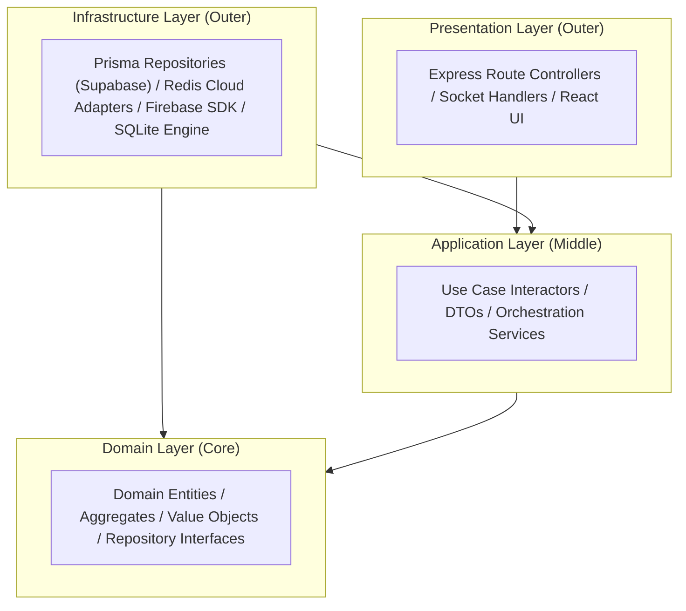
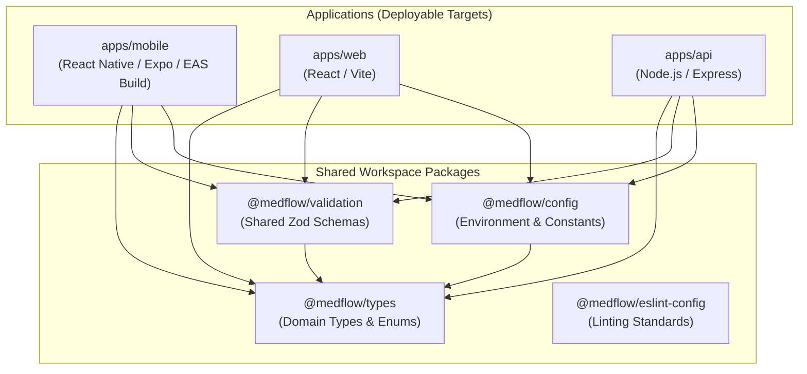

# MedFlow Architectural Dependency Rules & Layer Boundaries

## 1. Clean Architecture Layer Isolation
MedFlow enforces strict directional dependency constraints based on Clean Architecture and Domain-Driven Design (DDD). Inner layers define core business rules and interfaces; outer layers implement mechanisms, drivers, and frameworks.



### The Inward Dependency Invariant:
1. **Domain Layer (Core)** has **zero dependencies** on external frameworks, databases, or libraries. It does not import Express, Prisma, React, Firebase, or Redis. It defines repository interfaces ("ports") and pure business logic (e.g., START triage evaluation).
2. **Application Layer** depends exclusively on the Domain Layer. It orchestrates use cases, coordinates DTO conversions, and defines application services.
3. **Infrastructure Layer** depends inward on Application and Domain interfaces ("ports"), providing concrete implementations ("adapters") for Supabase PostgreSQL (via Prisma), SQLite, Redis Cloud, Firebase, and Mapbox.
4. **Presentation Layer** interacts only with Application Layer use cases to execute user requests. It never accesses database adapters or raw infrastructure directly.

---

## 2. Monorepo Dependency Graph & npm Workspaces

The repository is organized as an **npm workspaces monorepo**. Boundaries are enforced by TypeScript project references and ESLint import rules:



### Prohibited Cross-Application Dependencies:
- `apps/mobile` **MUST NEVER** import from `apps/api` or `apps/web`.
- `apps/web` **MUST NEVER** import from `apps/mobile` or `apps/api`.
- `apps/api` **MUST NEVER** import React or React Native packages.
- Shared logic must reside strictly in `@medflow/types`, `@medflow/validation`, or `@medflow/config`.

---

## 3. Feature-First Module Boundary Rules

Within each application (`apps/mobile`, `apps/web`, `apps/api`), code is organized by **Feature Bounded Contexts**:

```text
apps/api/src/
├── features/
│   ├── auth/
│   ├── intake/
│   ├── triage/
│   ├── inventory/
│   ├── telemetry/
│   ├── analytics/
│   └── audit/
```

### Cross-Feature Encapsulation Rules:
1. **Public Feature API**: A feature may only expose functionality through its top-level index or interface (e.g., `features/inventory/index.ts`).
2. **No Deep Internal Imports**: `features/triage` must never import directly from internal implementation paths like `features/inventory/internal/repository/bed-repo.ts`.
3. **Communication via Domain Events**: When an action in one feature affects another (e.g., admitting a patient in `triage` requires consuming a bed in `inventory`), the features interact via Domain Events published through an application event bus, rather than direct tight coupling.

---

## 4. Lint & Boundary Enforcement Configuration
Automated ESLint boundaries (`eslint-plugin-import` / `eslint-plugin-boundaries`) verify these rules during CI:

```javascript
// packages/eslint-config/index.js
module.exports = {
  rules: {
    'import/no-restricted-paths': [
      'error',
      {
        zones: [
          // Domain cannot import from Infrastructure, Application, or Presentation
          {
            target: './src/domain',
            from: ['./src/infrastructure', './src/application', './src/presentation']
          },
          // Application cannot import from Infrastructure or Presentation
          {
            target: './src/application',
            from: ['./src/infrastructure', './src/presentation']
          }
        ]
      }
    ]
  }
};
```
