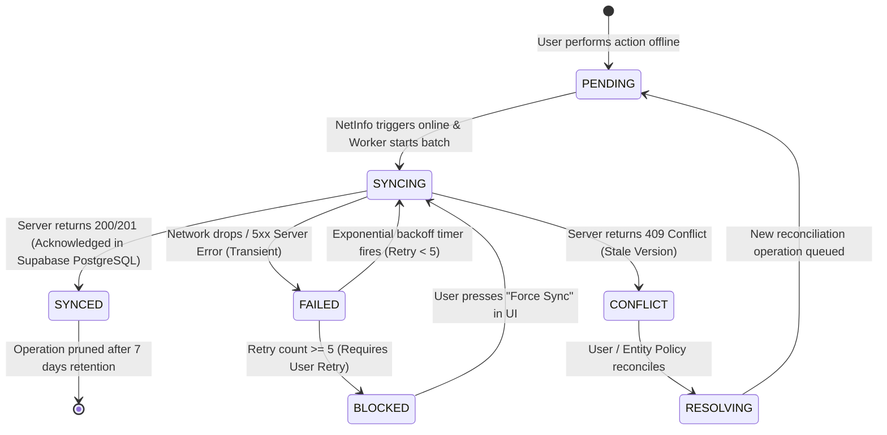

# MedFlow Offline-First Synchronization Architecture

## 1. Architectural Philosophy
In disaster zones, cellular base stations and Wi-Fi networks fail routinely. MedFlow treats the network as an intermittent luxury rather than an operational dependency. 

Field Paramedics and Clinical Responders must be capable of performing full intake, recording vital sign streams, capturing injury media, and executing START triage algorithms completely disconnected from the central server. The local client must never block user interactions due to network latency, server downtime, or transient transport errors.

---

## 2. Local Persistence & Outbox Model

```mermaid
flowchart TD
    subgraph MobileDevice["Mobile Client Runtime (React Native / EAS Build)"]
        UI["Emergency Intake & Triage UI"]
        Repo["Local Repository Layer"]
        SQLite[("Local SQLite Database")]
        OutboxTable[("Outbox Table<br/>(Mutations Queue)")]
        MediaBlobQueue[("Media Binary Outbox<br/>(Filesystem Cache)")]
        NetEngine["Network & Connectivity Manager<br/>(@react-native-community/netinfo)"]
        SyncWorker["Background Synchronization Worker"]
    end

    subgraph BackendGateway["MedFlow Core API (Express)"]
        SyncEndpoint["POST /api/v1/sync/batch"]
        PrismaBridge["Prisma ORM Client"]
    end

    subgraph HostedDatabase["Hosted Cloud Storage"]
        IdempotencyStore[("SyncHistory Table<br/>(Supabase PostgreSQL)")]
        DBTx[("ACID Transaction<br/>(Supabase PostgreSQL)")]
    end

    UI -->|"1. Local Mutation"| Repo
    Repo -->|"2. Write Local Entity"| SQLite
    Repo -->|"3. Enqueue Operation"| OutboxTable
    Repo -->|"4. Store Image/Audio file"| MediaBlobQueue

    NetEngine -.->|"5. Connection Restored Trigger"| SyncWorker
    SyncWorker -->|"6. Read PENDING Operations"| OutboxTable
    SyncWorker -->|"7. Batch POST with Operation IDs"| SyncEndpoint

    SyncEndpoint -->|"8. Verify Batch"| PrismaBridge
    PrismaBridge -->|"9. Check Idempotency Key"| IdempotencyStore
    PrismaBridge -->|"10. Apply Domain Mutations"| DBTx
    PrismaBridge -->|"11. Record SyncHistory & Audit"| DBTx
    SyncEndpoint -->>|"12. Batch Acknowledgment Payload"| SyncWorker

    SyncWorker -->|"13. Update Status to SYNCED / CONFLICT"| OutboxTable
    SyncWorker -->|"14. Invalidate TanStack Query Cache"| UI
```

---

## 3. SQLite Storage Schema & Outbox Entities

The mobile SQLite database maintains two core subsystems:
1. **Local Domain Mirrors**: Local copies of `patients`, `observations`, `triage_assessments`, `incidents`, and `inventory_items` required for instantaneous reading and offline editing.
2. **Outbox Queue Table (`outbox_operations`)**: An append-only queue of intended server mutations.

### Outbox Record Structure:
```sql
CREATE TABLE outbox_operations (
    operation_id TEXT PRIMARY KEY,        -- UUIDv4 generated at mutation time
    client_id TEXT NOT NULL,             -- Unique hardware/installation device ID
    entity_type TEXT NOT NULL,           -- 'PATIENT', 'OBSERVATION', 'TRIAGE', 'INVENTORY', 'LOCATION'
    entity_id TEXT NOT NULL,             -- Target entity UUID
    operation_type TEXT NOT NULL,        -- 'CREATE', 'UPDATE', 'DELETE'
    payload TEXT NOT NULL,               -- Serialized JSON mutation payload
    sync_status TEXT NOT NULL,           -- 'PENDING', 'SYNCING', 'SYNCED', 'FAILED', 'CONFLICT'
    client_timestamp INTEGER NOT NULL,   -- Epoch milliseconds on device
    server_timestamp INTEGER,            -- Epoch milliseconds assigned by Supabase PostgreSQL upon receipt
    retry_count INTEGER DEFAULT 0,       -- Number of failed sync attempts
    max_retries INTEGER DEFAULT 5,       -- Maximum automatic retry attempts
    last_error_message TEXT,             -- Normalized error message if failed
    last_attempt_at INTEGER,             -- Timestamp of last attempt
    created_at INTEGER NOT NULL          -- Local creation timestamp
);
CREATE INDEX idx_outbox_status ON outbox_operations(sync_status, created_at);
```

---

## 4. Operation Lifecycle & Synchronization State Machine



### Sync State Definitions:
- `PENDING`: Operation saved locally in SQLite; waiting for network or sync worker.
- `SYNCING`: Batch request currently in transit over HTTPS to Express API.
- `SYNCED`: Explicitly acknowledged and committed in Supabase PostgreSQL; local mirror updated.
- `FAILED`: Transient transport failure; queued for retry with exponential backoff.
- `BLOCKED`: Exceeded retry threshold (e.g., persistent payload validation error); flagged for manual user review.
- `CONFLICT`: Concurrency conflict detected on server; requires reconciliation.

---

## 5. Idempotency & Duplicate Prevention Strategy

Every network mutation from a mobile device carries an immutable `operationId` (UUIDv4) that acts as an **Idempotency Key**.

### Server-Side Ingestion Algorithm:
1. Client sends `POST /api/v1/sync/batch` to Express API with an array of operations:
   ```json
   {
     "deviceId": "dev-9876",
     "operations": [
       {
         "operationId": "c56a4180-65aa-42ec-a945-5fd21dec0538",
         "entityType": "OBSERVATION",
         "entityId": "pat-102",
         "operationType": "CREATE",
         "payload": { "heartRate": 110, "systolicBP": 90, "diastolicBP": 60 },
         "clientTimestamp": 1727550000000
       }
     ]
   }
   ```
2. The Express API initiates a Prisma transaction against Supabase PostgreSQL.
3. For each operation in the batch:
   - Queries `SyncHistory` table:
     ```sql
     SELECT status, response_payload FROM sync_history WHERE operation_id = $1;
     ```
   - **Case A: Operation Already Exists (`DUPLICATE_IGNORED`)**:
     The server does not re-apply the mutation. It immediately returns the cached `response_payload` previously saved. This prevents duplicate billing, duplicate vital records, or double resource decrements if a prior network acknowledgment was lost in transit.
   - **Case B: New Operation**:
     The server verifies business constraints, executes the mutation via Prisma, writes to `sync_history`, and writes to `audit_logs`.
4. Transaction commits atomically in Supabase PostgreSQL.
5. Server returns a granular, item-by-item status report:
   ```json
   {
     "processedAt": 1727550002100,
     "results": [
       {
         "operationId": "c56a4180-65aa-42ec-a945-5fd21dec0538",
         "status": "SUCCESS",
         "serverTimestamp": 1727550002050
       }
     ]
   }
   ```

---

## 6. Entity-Specific Conflict Resolution Policies

MedFlow rejects blind "Last Write Wins" (LWW) for clinical and operational records. Different entities follow strictly defined conflict policies:

| Entity | Primary Conflict Strategy | Justification & Technical Enforcement |
| :--- | :--- | :--- |
| **Patient Observations (Vitals)** | **Append-Only Event Stream** | Vital signs recorded at 14:02 and 14:05 are both clinically significant. They are never overwritten. Every observation is an immutable point-in-time record in Supabase PostgreSQL. Chronologically merged using `recordedAt`. |
| **Triage Assessments** | **Append-Only Clinical History + Server Validation** | Triage re-evaluations represent clinical progression. Re-classifications (e.g., from `YELLOW` to `RED`) are appended as new assessment records. The current active category is derived from the latest valid assessment. The Express server re-evaluates the START rule engine to prevent client tampering. |
| **Patient Demographics (Profile)** | **Optimistic Concurrency Control (OCC) with Versioning** | Patient records maintain an integer `version` field. If two responders update demographics simultaneously, the Express server verifies `expectedVersion` in Supabase PostgreSQL. On mismatch (409 Conflict), the newer server record wins, and the client's outbox marks the operation as `CONFLICT`, prompting the user to view the discrepancy. |
| **Hospital Resource Inventory** | **OCC with Atomic Deltas & Server Authority** | Inventory items enforce strict version checks (`version = version + 1`). If offline paramedic consumption collides with superintendent web changes, Supabase PostgreSQL accepts the transaction only if `quantityAvailable - delta >= 0`; otherwise, a `RESOURCE_EXHAUSTED` conflict is returned and flagged on the device. |
| **Ambulance Live Location** | **Newest Valid Timestamp (Monotonic Clock)** | High-frequency telemetry. If out-of-order GPS packets arrive due to network jitter, the Express server checks `recordedAt > currentRecordedAt`. Stale location packets ($T_{\text{packet}} < T_{\text{current}}$) are silently dropped without error. |
| **Media Attachments (Photos/Audio)** | **Independent Binary Ingestion** | Media files are uploaded independently to Firebase Storage. Supabase PostgreSQL only tracks immutable metadata references (`PatientMedia`). No conflicts exist because each photo or audio clip receives a globally unique UUID. |

---

## 7. Sync Worker Triggers & Exponential Backoff

### Automatic Triggers:
1. **Network Connectivity Change**: NetInfo fires `isConnected = true` and `isInternetReachable = true`.
2. **Application Lifecycle**: Paramedic brings the mobile app from background to foreground (`AppState = active`).
3. **Manual User Gesture**: Pull-to-refresh on patient queue or pressing the sync status chip.
4. **Immediate Outbox Hook**: If network is already active when user saves a record, the worker fires immediately without queue delay.

### Retry Backoff Formula:
When network or server errors occur (HTTP 500, 502, 503, 504, or Network Request Failed), the worker applies exponential backoff with jitter:
$$T_{\text{wait}} = \min\left(T_{\text{max}},\, T_{\text{base}} \times 2^{\text{retryCount}}\right) \pm \text{jitter}$$
- $T_{\text{base}} = 1000\,\text{ms}$ (1 second)
- $T_{\text{max}} = 30000\,\text{ms}$ (30 seconds)
- $\text{jitter} = \text{random}(0, 500\,\text{ms})$
- Maximum automatic attempts = 5.

---

## 8. User-Visible Sync Status System

The mobile application presents a continuous, non-intrusive status pill in the top app header:

| Indicator State | Visual Badge | Accessibility Label | User Action Allowed |
| :--- | :--- | :--- | :--- |
| **ONLINE** | 🟢 Green Dot + "Synced" | "System online, all data synchronized" | Normal operations |
| **OFFLINE** | ⚪ Gray Cloud + "Offline (Ready)" | "Working offline, changes saved locally" | Seamless intake & triage |
| **SYNCING** | 🔄 Blue Spinning Icon + "Syncing (3)..." | "Synchronizing 3 pending records" | Operations non-blocking |
| **SYNC ERROR** | 🟡 Yellow Warning + "Sync Paused" | "Sync paused due to poor network, retrying" | Tap to retry |
| **CONFLICT** | 🔴 Red Alert + "Action Required" | "Data conflict detected, tap to resolve" | Opens conflict review modal |
