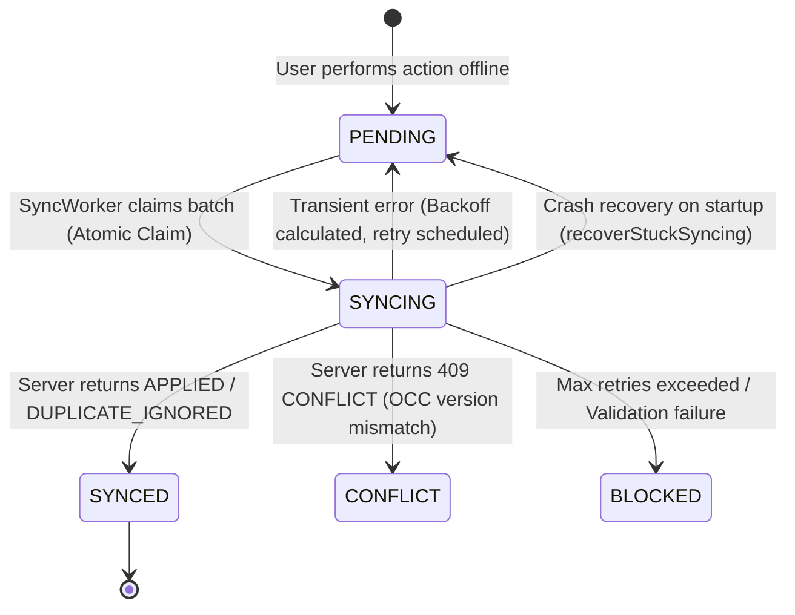

# MedFlow Architecture: Offline Synchronization Engine (Phase 7)

## 1. Architectural Model & Scope

MedFlow is engineered for disaster zones and extreme triage conditions where cellular connectivity is intermittent or completely severed. The offline synchronization engine guarantees that responders can capture patient intake records, track demographic updates, and record physiological vital sign observations continuously without dependency on an active internet connection.

### Storage Partitioning
- **Client Device (Mobile SQLite):** Acts as the local working cache and durable mutation outbox.
- **Backend (Supabase PostgreSQL via Express API):** Serves as the authoritative master system of record.
- **Strict Boundary:** The mobile application interacts exclusively through HTTPS REST endpoints and never connects directly to PostgreSQL, Supabase, or Redis.

```
┌─────────────────────────────────┐
│     React Native Mobile App     │
│   (Patient Intake & Vitals)     │
└────────────────┬────────────────┘
                 │ Local CRUD
          ┌──────▼──────┐
          │ SQLite (DB) │
          └──────┬──────┘
                 │ Durable Mutation
          ┌──────▼────────┐
          │ Outbox Queue  │ (PENDING / SYNCING / SYNCED / CONFLICT)
          └──────┬────────┘
                 │ Atomic Claim & Batching
          ┌──────▼────────┐
          │  Sync Engine  │
          └──────┬────────┘
                 │ HTTPS (POST /api/v1/sync/batch)
          ┌──────▼────────┐
          │  Express API  │ (Authentication, RBAC, Validation)
          └──────┬────────┘
                 │ Prisma Transaction
          ┌──────▼────────┐
          │  PostgreSQL   │
          │  SyncHistory  │ (Idempotency Registry & Master Tables)
          └───────────────┘
```

---

## 2. SQLite Schema & Outbox Design

The mobile local SQLite database maintains four primary tables:

### 2.1 `patients`
Local representation of patient intake records.
- `local_id` (TEXT PRIMARY KEY): Client-generated UUID.
- `server_id` (TEXT): Authoritative server UUID assigned upon sync.
- `demo_id` (TEXT): Human-readable identifier (e.g. `MED-PT-XXXX`).
- `incident_id` (TEXT): Associated incident UUID.
- `first_name`, `last_name`, `estimated_age`, `gender`, `status`, `current_triage_category`, `chief_complaint`, `notes`.
- `server_version` (INTEGER): Server version number (used for OCC).
- `sync_status` (TEXT): `PENDING` | `SYNCED` | `CONFLICT`.
- `is_dirty` (INTEGER): Flag indicating unsaved local changes.

### 2.2 `patient_vitals`
Local point-in-time clinical vital sign observations.
- Strictly append-only: rows are inserted and queried; updates and deletions are architecturally impossible.
- `id` (TEXT PRIMARY KEY), `local_patient_id`, `server_patient_id`, `recorded_by`, `systolic_bp`, `diastolic_bp`, `heart_rate`, `respiratory_rate`, `oxygen_saturation`, `temperature`, `gcs_score`, `source`, `sync_status`, `recorded_at`, `created_at`.

### 2.3 `outbox_operations`
Durable append-only queue of client-side mutations.
- `operation_id` (TEXT PRIMARY KEY): Client-generated UUID acting as an idempotency key.
- `client_id` (TEXT): Hardware/installation installation ID.
- `entity_type` (TEXT): `PATIENT` | `OBSERVATION`.
- `entity_id` (TEXT): Target local/server entity UUID.
- `operation_type` (TEXT): `CREATE` | `UPDATE` | `DELETE`.
- `payload` (TEXT): Serialized JSON mutation payload.
- `base_version` (INTEGER): Expected server version for OCC validation.
- `sync_status` (TEXT): `PENDING` | `SYNCING` | `SYNCED` | `FAILED` | `CONFLICT` | `BLOCKED`.
- `retry_count`, `max_retries`, `next_retry_at`, `conflict_details`.

---

## 3. Synchronization Lifecycle & State Machine



### State Transitions:
1. **PENDING → SYNCING:** Atomically updated within an SQLite transaction during `claimBatch`.
2. **SYNCING → SYNCED:** Operation acknowledged by server and local entity reconciled.
3. **SYNCING → PENDING (Retry):** Network failure or 5xx error calculates exponential backoff with jitter and sets `next_retry_at`.
4. **SYNCING → CONFLICT:** Version mismatch surfaces conflict details to user.
5. **SYNCING → BLOCKED:** Non-retryable error (e.g. malformed payload or permanent business rule failure).

---

## 4. Concurrency Protection & Serialization

1. **Worker Mutex:** Only one logical synchronization worker may run per device at any time. In-flight requests return the shared active Promise.
2. **Atomic Batch Claim:** Operations are claimed using `UPDATE outbox_operations SET sync_status = 'SYNCING' WHERE operation_id IN (...)` within an SQLite transaction, preventing race conditions between reconnect events and manual sync gestures.
3. **Crash Recovery (`recoverStuckSyncing`):** If the application process terminates mid-sync, all operations stuck in `SYNCING` status are reset to `PENDING` upon engine initialization.

---

## 5. Conflict Resolution Matrix

| Entity | Conflict Condition | Policy | Resolution Mechanism |
| :--- | :--- | :--- | :--- |
| **Patient Profile** | Server `version` differs from client `baseVersion` | Optimistic Concurrency Control (OCC) | Server rejects mutation with HTTP 409 `CONFLICT`. Outbox marks mutation `CONFLICT`. Client surfaces side-by-side reconciliation to user. |
| **Vital Signs** | Multiple observations recorded concurrently | Append-Only Stream | Zero conflict. Every observation represents an immutable point-in-time clinical record merged chronologically by `recordedAt`. |
