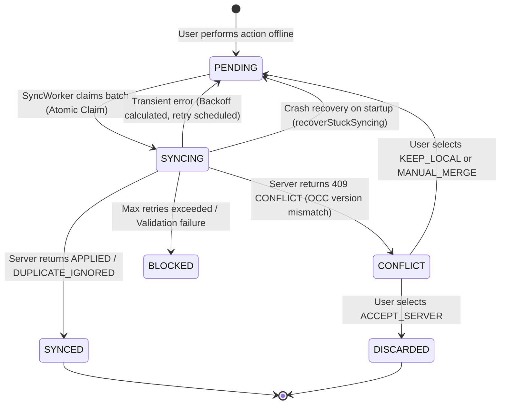

# MedFlow Architecture: Offline Synchronization Engine (Phase 7)

## 1. Architectural Model & Scope

MedFlow is engineered for disaster zones and extreme triage conditions where cellular connectivity is intermittent or completely severed. The offline synchronization engine guarantees that responders can capture patient intake records, track demographic updates, and record physiological vital sign observations continuously without dependency on an active internet connection.

### Storage Partitioning
- **Client Device (Mobile SQLite):** Acts as the local working cache and durable mutation outbox.
- **Backend (Supabase PostgreSQL via Express API):** Serves as the authoritative master system of record.
- **Strict Boundary:** The mobile application interacts exclusively through HTTPS REST endpoints and never connects directly to PostgreSQL, Supabase, or Redis.

```
┌─────────────────────────────────┐
│     React Native Mobile App     │
│   (Patient Intake & Vitals)     │
└────────────────┬────────────────┘
                 │ Local CRUD
          ┌──────▼──────┐
          │ SQLite (DB) │
          └──────┬──────┘
                 │ Durable Mutation
          ┌──────▼────────┐
          │ Outbox Queue  │ (PENDING / SYNCING / SYNCED / CONFLICT / DISCARDED)
          └──────┬────────┘
                 │ Atomic Claim & Batching
          ┌──────▼────────┐
          │  Sync Engine  │
          └──────┬────────┘
                 │ HTTPS (POST /api/v1/sync/batch)
          ┌──────▼────────┐
          │  Express API  │ (Authentication, RBAC, Domain Validation, Isolation)
          └──────┬────────┘
                 │ Isolated Per-Operation Transactions
          ┌──────▼────────┐
          │  PostgreSQL   │
          │  SyncHistory  │ (Idempotency Registry & Master Tables)
          └───────────────┘
```

---

## 2. SQLite Schema & Outbox Design

The mobile local SQLite database maintains four primary tables:

### 2.1 `patients`
Local representation of patient intake records.
- `local_id` (TEXT PRIMARY KEY): Client-generated UUID.
- `server_id` (TEXT): Authoritative server UUID assigned upon sync.
- `demo_id` (TEXT): Human-readable identifier (e.g. `MED-PT-XXXX`).
- `incident_id` (TEXT): Associated incident UUID.
- `first_name`, `last_name`, `estimated_age`, `gender`, `status`, `current_triage_category`, `chief_complaint`, `notes`.
- `server_version` (INTEGER): Server version number (used for OCC).
- `sync_status` (TEXT): `PENDING` | `SYNCED` | `CONFLICT`.
- `is_dirty` (INTEGER): Flag indicating unsaved local changes.

### 2.2 `patient_vitals`
Local point-in-time clinical vital sign observations.
- Strictly append-only: rows are inserted and queried; updates and deletions are architecturally impossible.
- `id` (TEXT PRIMARY KEY), `local_patient_id`, `server_patient_id`, `recorded_by`, `systolic_bp`, `diastolic_bp`, `heart_rate`, `respiratory_rate`, `oxygen_saturation`, `temperature`, `gcs_score`, `source`, `sync_status`, `recorded_at`, `created_at`.

### 2.3 `outbox_operations`
Durable append-only queue of client-side mutations.
- `operation_id` (TEXT PRIMARY KEY): Client-generated UUID acting as an idempotency key.
- `client_id` (TEXT): Unique persistent hardware/installation UUID (`DeviceIdentityService`).
- `entity_type` (TEXT): `PATIENT` | `OBSERVATION`.
- `entity_id` (TEXT): Target local/server entity UUID.
- `operation_type` (TEXT): `CREATE` | `UPDATE` | `DELETE`.
- `payload` (TEXT): Serialized JSON mutation payload.
- `base_version` (INTEGER): Expected server version for OCC validation.
- `sync_status` (TEXT): `PENDING` | `SYNCING` | `SYNCED` | `FAILED` | `CONFLICT` | `BLOCKED` | `DISCARDED`.
- `retry_count`, `max_retries`, `next_retry_at`, `conflict_details`.

---

## 3. Synchronization Lifecycle & State Machine



### State Transitions:
1. **PENDING → SYNCING:** Atomically updated within an SQLite transaction during `claimBatch`.
2. **SYNCING → SYNCED:** Operation acknowledged by server and local entity reconciled.
3. **SYNCING → PENDING (Retry):** Network failure or 5xx error calculates exponential backoff with jitter and sets `next_retry_at`.
4. **SYNCING → CONFLICT:** Version mismatch surfaces conflict details to user.
5. **CONFLICT → PENDING:** User resolves conflict via `KEEP_LOCAL` or `MANUAL_MERGE`.
6. **CONFLICT → DISCARDED:** User resolves conflict via `ACCEPT_SERVER`, discarding local changes.
7. **SYNCING → BLOCKED:** Non-retryable error (e.g. malformed payload or permanent business rule failure).

---

## 4. Conflict Resolution Workflow & Explicit Strategies

When an optimistic concurrency conflict occurs on patient demographics, the sync engine surfaces the conflict to the clinician:

1. **`KEEP_LOCAL` Strategy:**
   - Clinician determines the local field update should overwrite server data.
   - The engine updates the local patient `server_version` to `currentServerVersion`.
   - The outbox mutation is re-enqueued to `PENDING` with `base_version = currentServerVersion`.
   - On the next sync cycle, the server OCC check succeeds and advances to version $V+1$.

2. **`ACCEPT_SERVER` Strategy:**
   - Clinician accepts authoritative server state and discards local edits.
   - The engine updates the local patient record with `currentServerState`, sets `sync_status = 'SYNCED'` and `is_dirty = 0`.
   - The outbox mutation transitions to `DISCARDED`.

3. **`MANUAL_MERGE` Strategy:**
   - Clinician selectively merges specific fields from local and server states.
   - The engine writes merged fields to local SQLite and re-enqueues outbox mutation with merged payload and `base_version = currentServerVersion`.

---

## 5. Batch Failure Isolation & Strict Domain Validation

1. **Envelope Validation:** HTTP schema validation guarantees well-formed envelope, valid UUIDs, and authorized roles (`PARAMEDIC`, `TRIAGE_DOCTOR`).
2. **Strict Domain Payload Validation:** Each operation's payload is strictly validated against domain-specific Zod schemas (`syncPatientCreatePayloadSchema`, `syncPatientUpdatePayloadSchema`, `syncVitalCreatePayloadSchema`).
3. **Failure Isolation:** Each operation executes within its own isolated transaction boundary. If an operation fails domain validation or encounters a database constraint, it is recorded as `FAILED` in `sync_history`, while unrelated valid operations in the same batch commit successfully as `APPLIED`. This eliminates head-of-line batch blocking.

---

## 6. Synchronization UI Architecture

1. **`useSyncUIState` Hook:** Subscribes reactively to Zustand `syncStore` and provides formatted timestamps, status pill colors, pending counts, and trigger functions.
2. **`SyncStatusBar` Component:** Renders an accessible top banner with:
   - Online / Offline indicator dot and text
   - Pending operations badge count
   - Conflict warning pill (with count)
   - Last sync timestamp ("Just now", "2m ago", "Never synced")
   - Manual "Sync Now" button with disabled and active states
3. **`ConflictResolutionModal` Component:** Displays side-by-side comparison of local vs server fields with action buttons for `Keep Local Changes`, `Accept Server State`, and `Merge Changes`.
