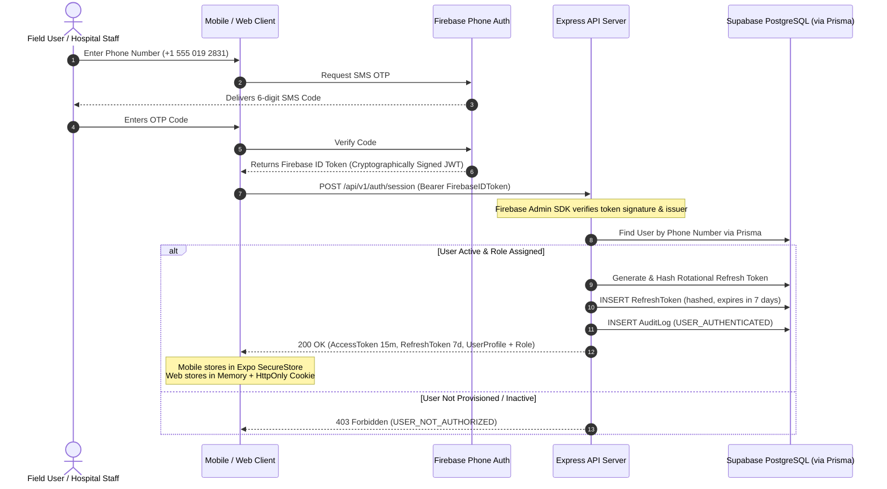

# MedFlow Security Architecture & Zero-Trust Threat Model

## 1. Security Philosophy & Principles
MedFlow is architected with a **Defense-in-Depth, Zero-Trust** security posture. Client applications (mobile devices in the field and web browsers in the hospital) operate in an untrusted network zone. 

No client assertion of identity, role, permission, triage classification, or inventory version is ever accepted without cryptographic verification and server-side policy enforcement.

---

## 2. Authentication & Session Architecture



### Key Security Standards:
1. **No Passwords**: Authentication relies exclusively on cryptographically verified phone numbers.
2. **Short-Lived Access Tokens**: JWT access tokens carry a 15-minute lifespan and contain:
   ```json
   {
     "sub": "usr-8891-uuid",
     "role": "PARAMEDIC",
     "assignedIncidentId": "inc-001",
     "exp": 1727551000,
     "iat": 1727550100
   }
   ```
3. **Rotating Refresh Tokens**: Refresh tokens are single-use, cryptographically random 256-bit strings stored in Supabase PostgreSQL as SHA-256 hashes. Upon refresh, the previous token is invalidated, and a new token pair is issued. If a revoked token is reused, the entire token family is immediately revoked (compromise detection).

---

## 3. Server-Side Role-Based Access Control (RBAC)

Client-side UI role checks only control visual rendering and layout adaptation. All authorization decisions are strictly enforced by Express backend middleware.

### Permission Matrix:
| Domain Action / Endpoint | Minimum Required Role | Resource-Level Ownership Guard |
| :--- | :--- | :--- |
| `POST /incidents` | `SUPERINTENDENT` | Hospital Command Center authority |
| `PATCH /incidents/:id` | `SUPERINTENDENT` | Hospital Command Center authority |
| `POST /patients` (Intake) | `PARAMEDIC` | Paramedic assigned to incident |
| `POST /patients/:id/observations` | `PARAMEDIC`, `TRIAGE_DOCTOR` | Assigned paramedic or attending hospital doctor |
| `POST /triage` (START assessment) | `PARAMEDIC`, `TRIAGE_DOCTOR` | Evaluator ID verified in audit |
| `PATCH /triage/:id` (Clinical override) | `TRIAGE_DOCTOR` | Requires mandatory `overrideReason` |
| `GET /inventory` | `PARAMEDIC`, `TRIAGE_DOCTOR`, `SUPERINTENDENT` | Authenticated read |
| `PATCH /inventory/:id` | `TRIAGE_DOCTOR`, `SUPERINTENDENT` | Optimistic Concurrency check |
| `GET /analytics/*` | `SUPERINTENDENT` | Administrative boundary |
| `GET /audit` & `POST /audit/export` | `SUPERINTENDENT` | High-security administrative boundary |

### Middleware Implementation:
```typescript
// RBAC Middleware (apps/api/src/presentation/middlewares/authorize.ts)
export const requireRole = (allowedRoles: Role[]) => {
  return (req: Request, res: Response, next: NextFunction) => {
    const user = req.user;
    if (!user || !allowedRoles.includes(user.role)) {
      return res.status(403).json({
        type: 'https://medflow.org/errors/forbidden',
        title: 'Forbidden',
        status: 403,
        detail: `Role '${user?.role}' does not possess permissions for this resource.`,
        code: 'INSUFFICIENT_ROLE_PERMISSIONS'
      });
    }
    next();
  };
};
```

---

## 4. Mobile Credential Storage & SQLite Encryption
- **Expo SecureStore**: Refresh tokens, session secrets, and device identity keys are stored exclusively in hardware-backed secure storage (Keychain on iOS; KeyStore encrypted SharedPreferences on Android).
- **No Plaintext AsyncStorage**: Sensitive auth tokens or unmasked patient health data must never be stored in React Native's default unencrypted `AsyncStorage`.
- **Local SQLite Database**: Operates within the application's private sandboxed directory. On enterprise deployment, SQLCipher 256-bit AES encryption is applied with keys held in SecureStore.
- **EAS Cloud Builds**: Packaged through Expo Application Services (EAS Build) without requiring local Android Studio, Android SDK, or JDK installations.

---

## 5. API Input Validation & Defense Against Injection
- **Zod Schema Gateways**: Every request payload entering the Express API server is parsed and validated by strict Zod schemas before reaching any controller or service logic. Unknown keys are stripped (`strip()` or `strict()`).
- **SQL Injection Prevention**: All database access executes via Prisma ORM parameterized queries or strict raw queries with parameterized placeholders (`$1, $2`). Dynamic string interpolation in SQL statements is strictly prohibited.
- **Cross-Site Scripting (XSS) & Header Hardening**: Express utilizes Helmet to inject security headers:
  - `Content-Security-Policy (CSP)`
  - `X-Frame-Options: DENY`
  - `X-Content-Type-Options: nosniff`
  - `Strict-Transport-Security: max-age=31536000; includeSubDomains`

---

## 6. Media Upload Authorization & File Validation
- **No Direct Binary Uploads to Supabase PostgreSQL**: The database stores only media metadata (UUID, URL, MIME type, size, captured timestamp).
- **Pre-Signed Upload URLs**: When a paramedic uploads injury photos or audio notes, the Express API verifies authorization and generates a time-limited (10-minute) pre-signed upload URL to Firebase Storage.
- **Server Validation Pipeline**:
  - Max photo file size: 5 MB.
  - Max audio file size: 2 MB.
  - MIME-type enforcement via binary magic numbers (JPEG `FF D8 FF`, PNG `89 50 4E 47`, M4A `ftypM4A`), rejecting forged `.exe` or `.sh` files disguised as images.

---

## 7. Rate Limiting & Denial of Service (DoS) Mitigation
**Redis Cloud**-backed sliding window rate limiters protect the Express API gateway:
- **Authentication Endpoints (`/api/v1/auth/*`)**: 5 requests per minute per IP to prevent OTP brute-force and SMS bombing.
- **Sync Ingestion Endpoint (`/api/v1/sync/batch`)**: 30 requests per minute per authenticated device.
- **Standard Read Endpoints (`/api/v1/*`)**: 120 requests per minute per IP.

---

## 8. Logging Sanitation & Audit Protection
### Logging Blacklist:
The application logging framework (Pino) automatically scrubs the following fields from all logs:
- `authorization` header
- `accessToken`, `refreshToken`
- `otp`, `smsCode`
- Patient names and identifying details

### Immutability of Audit Records:
1. Normal application database credentials possess only `SELECT` and `INSERT` permissions on the `AuditLog` table in Supabase PostgreSQL.
2. An explicit PostgreSQL trigger rejects any `UPDATE` or `DELETE` on the `audit_logs` table:
```sql
CREATE OR REPLACE FUNCTION prevent_audit_tampering()
RETURNS TRIGGER AS $$
BEGIN
    RAISE EXCEPTION 'Audit records are immutable and cannot be updated or deleted.';
END;
$$ LANGUAGE plpgsql;

CREATE TRIGGER trg_protect_audit_logs
BEFORE UPDATE OR DELETE ON audit_logs
FOR EACH ROW EXECUTE FUNCTION prevent_audit_tampering();
```
