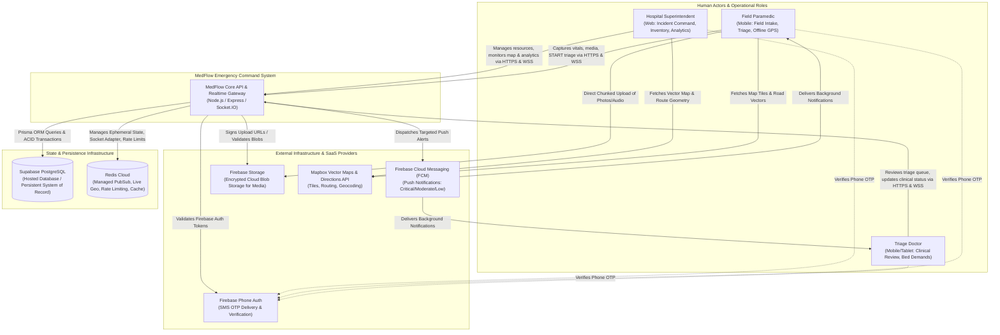
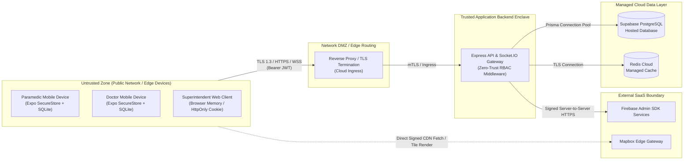

# MedFlow System Context & External Architecture

## 1. Executive Summary & Purpose
**MedFlow: Emergency Telehealth & Disaster Response Command System** is an offline-first, real-time coordination platform connecting field paramedics, emergency room triage doctors, and hospital superintendents during mass-casualty incidents and disaster scenarios.

This document establishes the C4 Level 1 (System Context) and Level 2 (Container) boundaries for MedFlow, illustrating how client applications, core backend services, data stores, and external cloud infrastructure interact as a single integrated system.

---

## 2. System Context Diagram (C4 Level 1)

---

## 3. Boundary & Responsibility Decomposition

| Entity / Container | Classification | Primary Responsibilities | Data Handled / Transferred |
| :--- | :--- | :--- | :--- |
| **Paramedic Mobile App** | Client (React Native / Expo / EAS Build) | Offline patient data capture, START triage evaluation, camera/audio recording, local SQLite database, outbox sync engine, background GPS tracking. Built via EAS Cloud. | Local patient draft, vitals, compressed images, AAC audio, GPS coordinates, local outbox mutation queue. |
| **Doctor Mobile App** | Client (React Native / Expo / EAS Build) | Real-time intake queue review, clinical triage verification, dynamic hospital bed requests, high-priority emergency notifications. Built via EAS Cloud. | Live patient triage stream, vital trend streams, admission requests. |
| **Superintendent Web** | Client (React / Vite) | Incident command center, live ambulance vector map, dynamic resource inventory CRUD, real-time analytics graphs, immutable audit log viewer, CSV/JSON export. | Incident overview, real-time resource levels, hospital bed/O2/drug metrics, live telemetry, audit events. |
| **Express API & Realtime Gateway** | Primary Backend Service (Node.js / Express / Socket.IO) | Token verification, RBAC enforcement, business domain operations, optimistic concurrency validation, sync outbox processing, audit trail generation, push notification dispatch. | Authenticated requests, domain mutations, idempotency keys, Socket.IO rooms and events. |
| **Supabase PostgreSQL** | Hosted Database (System of Record) | Authoritative, hosted PostgreSQL system of record for all business entities: users, incidents, patients, observations, triage decisions, inventory items, audit logs. Accessed exclusively via Prisma ORM from Express. | Normalized relational schemas, ACID transactions, foreign key constraints, B-Tree indexes. |
| **Redis Cloud** | Managed Ephemeral Cache & Broker | Socket.IO Redis Adapter for horizontal coordination, high-frequency ambulance telemetry buffer, distributed locks, API rate-limiting sliding windows. Never permanent source of truth. | Active socket connections, volatile live vehicle GPS coordinates, user presence, sliding rate-limit counters. |
| **Firebase Auth** | External Identity Provider | Telephony-based SMS OTP delivery, verification, and initial cryptographic proof of phone number identity. | Phone numbers, SMS codes, Firebase ID Tokens. |
| **Firebase Storage** | External Object Store | Durable binary object storage for patient injury photos and paramedic audio notes. | Compressed JPEG/PNG images, AAC/M4A voice memos. |
| **Firebase Cloud Messaging** | External Push Provider | Delivery of high-priority APNs/FCM push notifications to backgrounded/inactive mobile clients. | Notification payloads, device registration tokens, alert priority flags (`CRITICAL`, `MODERATE`, `LOW`). |
| **Mapbox API** | External Geospatial Service | Map vector tiles, dynamic turn-by-turn routing between incident sites and emergency facilities, geocoding. | Geospatial geoJSON geometries, route polylines, ETA calculations. |

---

## 4. Trust Boundaries & Security Enclaves

### Trust Boundary Rules:
1. **Never trust client-asserted identity or roles**: Mobile and web clients submit signed JWTs. Roles are loaded from trusted backend database records or verified custom claims strictly controlled by the Express backend.
2. **Express is the Sole Application Gateway**: Clients **never** connect directly to Supabase PostgreSQL or Redis Cloud. All core business mutations and queries flow exclusively through the Express API using Prisma ORM. Supabase Edge Functions and Supabase API routes are explicitly excluded.
3. **No Database Credentials on Clients**: All Supabase connection strings (`DATABASE_URL`), Redis Cloud credentials (`REDIS_URL`), and Firebase Admin credentials remain strictly within `apps/api` environment configurations.
4. **Cloud Build Pipeline**: Mobile applications are built in the cloud via EAS (Expo Application Services). Android Studio, Android SDKs, and JDK are not required local development prerequisites.
