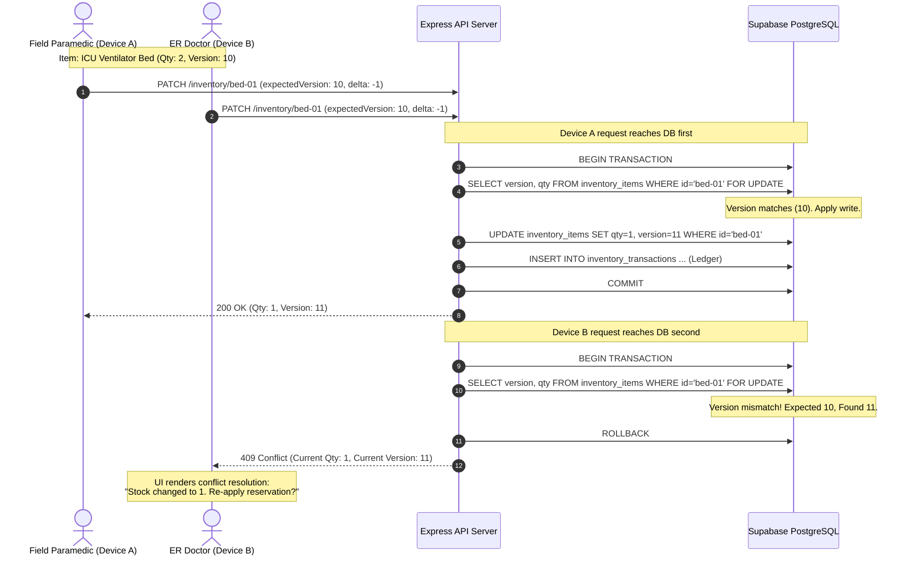

# MedFlow Conflict Resolution Matrix & Entity Synchronization Policies

## 1. Why Universal Conflict Strategies Fail in Emergency Systems
In traditional web applications, simplistic conflict strategies like "Last-Write-Wins" (LWW) are common. In emergency response, LWW is dangerous:
- Overwriting an earlier vital sign measurement destroys the patient's physiological deterioration trend.
- Overwriting an emergency room bed count without optimistic locking creates phantom beds and patient diversion failures.
- Overwriting an incident status can cause responders to arrive at closed disaster zones.

MedFlow mandates **entity-specific conflict strategies** anchored by Supabase PostgreSQL as the final server authority.

---

## 2. Comprehensive Conflict Resolution Matrix

| Entity | Conflict Scenario | Technical Strategy | Server Authority (Supabase PostgreSQL) | Client Behavior (Mobile / Web) |
| :--- | :--- | :--- | :--- | :--- |
| **Patient Profile (Demographics)** | Two responders update age/name while one was offline. | **Optimistic Concurrency Control (OCC) with Integer Versioning** | Rejects stale `expectedVersion` with HTTP 409 Conflict. Returns latest server state. | Client outbox marks operation `CONFLICT`. Mobile UI preserves local draft and prompts user with side-by-side reconciliation modal. |
| **Patient Observations (Vitals)** | Paramedic records vitals offline at 14:00; Doctor records vitals in ER at 14:02; Paramedic reconnects. | **Append-Only Event Stream (Zero Conflict)** | Accepts all valid observation rows. Orders measurements chronologically by `recorded_at`. | Client inserts local points into continuous historical graph. No data is lost; both measurements preserved. |
| **START Triage Assessments** | Paramedic evaluates patient `YELLOW` in field; Doctor reclassifies as `RED` in ER; field sync arrives later. | **Append-Only Clinical History + Transactional Projection** | Evaluates timestamps: if server has newer assessment, incoming older assessment is inserted as historical (`is_current = false`). Doctor's active `RED` assessment retains `is_current = true`. | Doctor's active `RED` classification persists. Paramedic's earlier evaluation is retained in timeline for triage review. `patients.current_triage_category` reflects active assessment. |
| **Hospital Resource Inventory** | Doctor and Superintendent simultaneously decrement ICU beds from 5 to 4. | **Strict OCC (`version = version + 1`) + Row Locking** | Evaluates atomic transaction with `SELECT ... FOR UPDATE`. First commit advances version to 6; second commit fails with 409 Conflict. | Second client receives 409 Conflict with current quantity (4); UI presents updated stock and prompts user: "1 bed remaining. Confirm reservation?" |
| **Incident Status & Phase** | Paramedic marks incident `RESOLVED` offline while Command Center marks it `CRITICAL_INFLUX`. | **Server Authority with Role Precedence** | Command Center (`SUPERINTENDENT`) operational updates override field paramedic incident status updates. | Paramedic app updates incident banner to `CRITICAL_INFLUX` with notification: "Incident escalated by Command Center." |
| **Media Attachments (Photos/Audio)** | Two field devices upload photos for the same patient simultaneously. | **Independent Binary Ingestion** | Both media uploads succeed independently; each receives a globally unique UUID. | Media gallery displays both photographs tagged with their respective photographer UUIDs. |
| **Ambulance Live GPS Telemetry** | High-frequency telemetry packets arrive out of chronological order due to cellular jitter. | **Monotonic Clock Check (Newest Valid Timestamp)** | Checks `recorded_at > current_recorded_at`. Stale packets ($T_{\text{packet}} < T_{\text{current}}$) are silently dropped. | Mapbox animated vehicle marker smoothly moves forward without rubber-banding backward. |
| **Notification Delivery State** | User marks notification `READ` on web; mobile client marks delivery `READ` offline. | **Idempotent Delivery State Convergence** | If already marked `READ`, subsequent delivery update is acknowledged as successful (`200 OK`) without side effects. | Delivery status converges to `READ` across devices without error. |

---

## 3. Detailed OCC Workflow for Inventory & Demographics

