# MedFlow Persistent Data Architecture & Core Data Model

## 1. Executive Summary & Design Principles
MedFlow is an emergency telehealth and disaster response command system operating in high-stress, occasionally disconnected environments. The database architecture is designed as a **modular relational schema with 18 normalized tables** hosted on **Supabase PostgreSQL** and queried exclusively through the **Express API** via **Prisma ORM**.

### Core Engineering Principles:
1. **Relational Integrity & Normalization**: Data is normalized to 3NF to eliminate anomalies, enforce referential integrity via explicit foreign keys, and avoid duplicate state.
2. **Append-Oriented Clinical Data**: High-frequency, time-varying clinical observations (`patient_vitals`) and triage records (`triage_assessments`) are modeled as immutable append-only event streams. This completely eliminates destructive write conflicts during offline synchronization.
3. **Denormalized Operational Projection for Active Triage**: `patients.current_triage_category` is maintained transactionally by the backend as a denormalized operational projection from the current triage assessment. It is not an independent source of truth; the authoritative history resides in `triage_assessments`.
4. **Strict Optimistic Concurrency Control (OCC)**: Concurrently edited master entities (`inventory_items`, `patients`, `incidents`) enforce integer `version` columns and database-level row locking within Prisma transactions.
5. **Separation of Binary & Metadata**: Media binaries (JPEG injury photos, AAC/M4A audio memos) are stored exclusively in Firebase Storage; only immutable structured metadata (UUID, storage path, MIME type, duration, byte size) is stored in PostgreSQL.
6. **Separation of Notification Event & Deliveries**: `notifications` records the message payload and priority; `notification_deliveries` tracks delivery to individual recipients and devices.
7. **Single Operational Role per User**: MedFlow currently supports exactly one active operational role per user (`PARAMEDIC`, `TRIAGE_DOCTOR`, `HOSPITAL_SUPERINTENDENT`). The prototype has three fixed operational roles and does not currently require multi-role assignments. Backend authorization middleware acts as the actual security boundary.
8. **Application-Level Immutable Audit Log**: Clinical and administrative mutations write to an append-only `AuditLog` table. Normal application users cannot update or delete audit records. PostgreSQL triggers provide an additional database-level protection against `UPDATE` and `DELETE` operations.

---

## 2. High-Level Relational Topology (18 Tables)

```mermaid
flowchart TD
    subgraph Identity_RBAC["1. Identity, Users & Devices (3 tables)"]
        User["users (Profile & Role)"]
        Device["devices (Hardware & Push Tokens)"]
        RefreshToken["refresh_tokens (Hashed Sessions)"]
        User --> Device
        User --> RefreshToken
        Device --> RefreshToken
    end

    subgraph Incident_Fleet["2. Incidents & Ambulance Fleet (4 tables)"]
        Incident["incidents (Disaster Site)"]
        Ambulance["ambulances (Fleet Units)"]
        IncidentAssignment["incident_assignments (Dispatch & Allocation)"]
        LocationHistory["location_history (Sampled GPS Breadcrumbs)"]
        Incident --> IncidentAssignment
        User --> IncidentAssignment
        Ambulance --> IncidentAssignment
        Ambulance --> LocationHistory
    end

    subgraph Patient_Clinical["3. Patient Domain & Clinical Records (4 tables)"]
        Patient["patients (Demographics & Projections)"]
        PatientVitalSign["patient_vitals (Append-Only Observations)"]
        PatientMedia["patient_media (Photo/Audio References)"]
        TriageAssessment["triage_assessments (Append-Only START Evaluations)"]
        Incident --> Patient
        Patient --> PatientVitalSign
        Patient --> PatientMedia
        Patient --> TriageAssessment
        User --> PatientVitalSign
        User --> PatientMedia
        User --> TriageAssessment
    end

    subgraph Inventory_Concurrency["4. Hospital Life-Support Inventory (2 tables)"]
        InventoryItem["inventory_items (Beds, O2, Drugs - OCC Versioned)"]
        InventoryTransaction["inventory_transactions (Stock Movement Ledger)"]
        InventoryItem --> InventoryTransaction
        User --> InventoryTransaction
        Patient -.-> InventoryTransaction
    end

    subgraph Notifications_System["5. Notifications (2 tables)"]
        Notification["notifications (Alert Message & Priority)"]
        NotificationDelivery["notification_deliveries (Recipient / Device Status)"]
        Notification --> NotificationDelivery
        User --> NotificationDelivery
        Device --> NotificationDelivery
    end

    subgraph Ops_Audit_Analytics["6. Audit, Analytics & Sync (3 tables)"]
        AuditLog["audit_logs (Application-Level Immutable Audit Log)"]
        DomainEvent["domain_events (Analytics Raw Event Pipeline)"]
        SyncHistory["sync_history (Idempotency Key Registry)"]
        User --> AuditLog
        User --> SyncHistory
    end
```

---

## 3. Storage Strategy & Data Tiering

| Data Tier | Storage Medium | Access Frequency | Retention Policy | Mutability |
| :--- | :--- | :--- | :--- | :--- |
| **Operational Business Data** | Supabase PostgreSQL | Very High (REST queries via Prisma) | Indefinite / Operational | Mutable with OCC (`version`) |
| **Clinical Observation Stream** | Supabase PostgreSQL | High (Append on intake/triage) | Indefinite (Medical history) | **Immutable / Append-Only** |
| **Audit Logs** | Supabase PostgreSQL | Medium (Write on mutation; Read on audit) | Indefinite (Protected by DB Trigger) | **Immutable / Append-Only** |
| **Raw Analytics Events** | Supabase PostgreSQL | High (Write on lifecycle; Aggregated in batch) | Standard table retention | **Immutable / Append-Only** |
| **Vehicle GPS Breadcrumbs** | Supabase PostgreSQL | Medium (Sampled every 30s) | Standard table retention | **Immutable / Append-Only** |
| **Binary Media Blobs** | Firebase Storage | Low-Medium (Direct client upload/fetch) | Indefinite (Object Lifecycle) | Immutable write-once |
| **Live Telemetry & Transient PubSub** | Redis Cloud | Ultra-High (1 Hz GPS updates, Socket rooms) | TTL 15s (Coordinates expire) | Ephemeral / In-Memory |
| **Offline Mutations Queue** | Mobile SQLite | High (Local writes while disconnected) | Pruned after server ack | Local Append-Only |

*Note on Location History & Telemetry Retention*: Partitioning and long-term telemetry retention are deferred performance optimizations and will only be introduced if required by measured workload.

---

## 4. Connection Model: Supabase PostgreSQL, Prisma & Express
Supabase serves as the hosted PostgreSQL infrastructure provider. The Express application accesses Supabase PostgreSQL according to the following connection architecture:

1. **Runtime Application Connection**: Express uses pooled/transaction connections for application runtime when appropriate. Prisma pooling parameters are configured according to Supabase pooler requirements (e.g. `pgbouncer=true`).
2. **Prisma CLI / Migration Connection**: Prisma CLI operations (migrations, schema push, introspections) use direct/session connections requiring session continuity.
3. **Configuration Authority**: The exact connection strings come directly from the Supabase Connect dashboard.
4. **Transport Security**: PostgreSQL connections use encrypted TLS/SSL connections according to the Supabase database connection configuration.
5. **No Direct Client Database Access**: Edge clients never connect directly to Supabase. Express is the sole application boundary.
