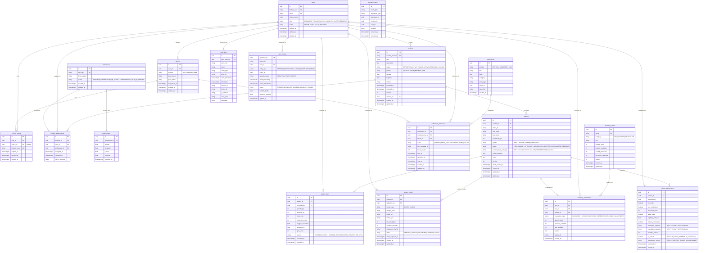

# MedFlow Entity Relationship Diagram (ERD)

## 1. Complete System Entity Relationship Diagram (18 Tables)

```mermaid
erDiagram
    %% ==========================================
    %% 1. IDENTITY & SESSIONS
    %% ==========================================
    users ||--o{ devices : "registers"
    users ||--o{ refresh_tokens : "owns"
    devices ||--o{ refresh_tokens : "owns"

    %% ==========================================
    %% 2. INCIDENTS & FLEET
    %% ==========================================
    users ||--o{ incidents : "creates"
    incidents ||--o{ incident_assignments : "has"
    users ||--o{ incident_assignments : "assigned_to"
    ambulances ||--o{ incident_assignments : "allocated_to"
    ambulances ||--o{ location_history : "records_gps"

    %% ==========================================
    %% 3. PATIENTS & CLINICAL OBSERVATIONS
    %% ==========================================
    incidents ||--o{ patients : "contains"
    patients ||--o{ patient_vitals : "has_vitals"
    users ||--o{ patient_vitals : "recorded_by"
    patients ||--o{ patient_media : "attaches_media"
    users ||--o{ patient_media : "uploaded_by"
    patients ||--o{ triage_assessments : "evaluates"
    users ||--o{ triage_assessments : "assessed_by"

    %% ==========================================
    %% 4. INVENTORY & CONCURRENCY
    %% ==========================================
    inventory_items ||--o{ inventory_transactions : "audits_stock"
    users ||--o{ inventory_transactions : "executed_by"
    patients ||--o{ inventory_transactions : "consumed_by"

    %% ==========================================
    %% 5. NOTIFICATIONS & DELIVERIES
    %% ==========================================
    notifications ||--o{ notification_deliveries : "dispatches"
    users ||--o{ notification_deliveries : "delivered_to"
    devices ||--o{ notification_deliveries : "received_by"

    %% ==========================================
    %% 6. AUDIT, ANALYTICS & SYNC
    %% ==========================================
    users ||--o{ audit_logs : "performed_by"
    users ||--o{ sync_history : "submitted_by"

    %% ==========================================
    %% ENTITY DEFINITIONS & ATTRIBUTES
    %% ==========================================
    users {
        uuid id PK
        string firebase_uid UK
        string phone UK
        string display_name
        string role "PARAMEDIC | TRIAGE_DOCTOR | HOSPITAL_SUPERINTENDENT"
        string status "ACTIVE | INACTIVE | SUSPENDED"
        timestamptz created_at
        timestamptz updated_at
        timestamptz deleted_at
    }

    devices {
        uuid id PK
        uuid user_id FK
        string platform "IOS | ANDROID | WEB"
        string app_version
        string push_token
        timestamptz last_active_at
        timestamptz created_at
        timestamptz updated_at
    }

    refresh_tokens {
        uuid id PK
        uuid user_id FK
        uuid device_id FK "nullable"
        string hashed_token UK
        timestamptz expires_at
        timestamptz revoked_at
        timestamptz created_at
    }

    incidents {
        uuid id PK
        string incident_number UK
        string title
        text description
        string status "REPORTED | ACTIVE | TRIAGE_ACTIVE | RESOLVED | CLOSED"
        string priority "CRITICAL | HIGH | MEDIUM | LOW"
        float latitude
        float longitude
        string address
        timestamptz reported_at
        timestamptz resolved_at
        int version
        uuid created_by FK
        timestamptz created_at
        timestamptz updated_at
    }

    ambulances {
        uuid id PK
        string call_sign UK
        string license_plate
        string status "AVAILABLE | DISPATCHED | ON_SCENE | TRANSPORTING | OUT_OF_SERVICE"
        timestamptz created_at
        timestamptz updated_at
    }

    incident_assignments {
        uuid id PK
        uuid incident_id FK
        uuid user_id FK
        uuid ambulance_id FK
        timestamptz assigned_at
        timestamptz released_at
        string role_in_incident
    }

    location_history {
        uuid id PK
        uuid ambulance_id FK
        float latitude
        float longitude
        float speed
        float heading
        timestamptz recorded_at
    }

    patients {
        uuid id PK
        uuid incident_id FK
        string demo_id UK
        string first_name
        string last_name
        int estimated_age
        string gender "MALE | FEMALE | OTHER | UNKNOWN"
        string status "FIELD_INTAKE | IN_TRANSIT | ARRIVED_ER | ADMITTED | DISCHARGED | DECEASED"
        string current_triage_category "RED | YELLOW | GREEN | BLACK | UNASSESSED (Projection)"
        text chief_complaint
        text notes
        int version
        timestamptz client_created_at
        timestamptz created_at
        timestamptz updated_at
        timestamptz deleted_at
    }

    patient_vitals {
        uuid id PK
        uuid patient_id FK
        uuid recorded_by FK
        int systolic_bp
        int diastolic_bp
        int heart_rate
        int respiratory_rate
        float oxygen_saturation
        float temperature
        int gcs_score
        string source "PARAMEDIC_FIELD | MONITOR_DEVICE | DOCTOR_ER | OFFLINE_SYNC"
        timestamptz recorded_at
        timestamptz created_at
    }

    patient_media {
        uuid id PK
        uuid patient_id FK
        uuid uploaded_by FK
        string media_type "PHOTO | AUDIO"
        string storage_path
        string public_url
        string mime_type
        int file_size_bytes
        int duration_seconds
        string checksum_sha256
        string status "PENDING_UPLOAD | UPLOADED | VERIFIED | FAILED"
        timestamptz client_captured_at
        timestamptz created_at
        timestamptz updated_at
    }

    triage_assessments {
        uuid id PK
        uuid patient_id FK
        uuid assessed_by FK
        boolean can_walk
        boolean has_respirations
        int respiratory_rate
        boolean radial_pulse
        float capillary_refill_sec
        boolean follows_commands
        string calculated_category "RED | YELLOW | GREEN | BLACK"
        string overridden_category "RED | YELLOW | GREEN | BLACK"
        text override_reason
        boolean is_current "Partial UK (patient_id WHERE is_current=true)"
        string assessment_source "FIELD_START | ER_TRIAGE_REASSESSMENT"
        timestamptz assessed_at
        timestamptz created_at
    }

    inventory_items {
        uuid id PK
        string name UK
        string category "BED | OXYGEN | MEDICATION"
        string unit
        int quantity_total
        int quantity_available
        int quantity_reserved
        int low_stock_threshold
        int version
        timestamptz created_at
        timestamptz updated_at
    }

    inventory_transactions {
        uuid id PK
        uuid item_id FK
        uuid user_id FK
        uuid patient_id FK
        string transaction_type "CONSUMED | RECEIVED_RESTOCK | RESERVED | RELEASED | ADJUSTMENT"
        int quantity_delta
        int previous_available
        int new_available
        text reason
        string request_id
        timestamptz created_at
    }

    notifications {
        uuid id PK
        string priority "CRITICAL | MODERATE | LOW"
        string title
        text body
        string category
        string entity_type
        uuid entity_id
        string deep_link
        timestamptz created_at
    }

    notification_deliveries {
        uuid id PK
        uuid notification_id FK
        uuid recipient_user_id FK
        uuid device_id FK
        string status "QUEUED | SENT_FCM | DELIVERED | READ | FAILED"
        string fcm_message_id
        text failure_reason
        timestamptz sent_at
        timestamptz delivered_at
        timestamptz read_at
        timestamptz created_at
        timestamptz updated_at
    }

    audit_logs {
        uuid id PK
        uuid actor_user_id FK
        string actor_role
        string action
        string entity_type
        string entity_id
        timestamptz client_timestamp
        timestamptz timestamp
        string request_id
        string device_id
        string ip_address
        string user_agent
        jsonb metadata
    }

    domain_events {
        uuid id PK
        string event_type
        string aggregate_type
        uuid aggregate_id
        uuid incident_id
        uuid user_id
        jsonb payload
        timestamptz occurred_at
        timestamptz recorded_at
    }

    sync_history {
        uuid operation_id PK
        string device_id
        uuid user_id FK
        string entity_type "PATIENT | OBSERVATION | TRIAGE | INVENTORY | MEDIA"
        uuid entity_id
        string operation_type "CREATE | UPDATE | DELETE"
        timestamptz client_timestamp
        timestamptz server_timestamp
        string status "APPLIED | DUPLICATE_IGNORED | CONFLICT | FAILED"
        jsonb conflict_details
        jsonb response_payload
        timestamptz applied_at
    }
```
