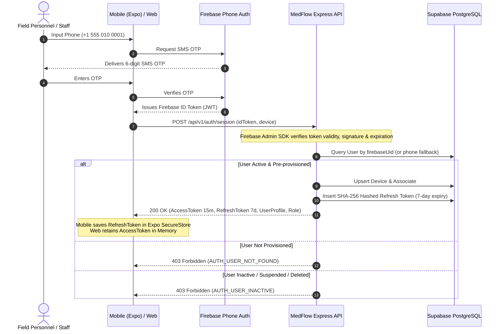
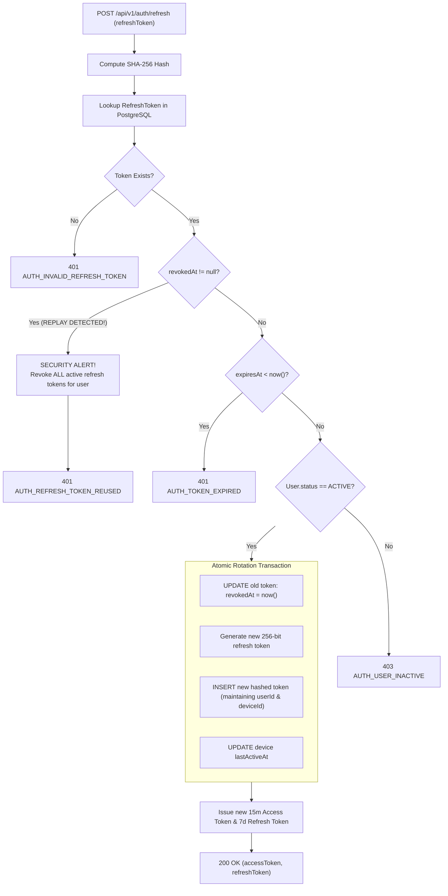

# MedFlow Security Specification: Authentication, Session Management & RBAC

**Document Type:** Security Architecture & Implementation Specification  
**Phase:** Phase 5 — Authentication, Session Management & Role-Based Access Control  
**Module:** Core Security & Identity Engine  
**Status:** Approved Implementation Baseline  
**Classification:** Internal Engineering & Prototype Defense Reference  

> [!IMPORTANT]
> **Regulatory & Compliance Disclaimer:** MedFlow is an engineering prototype designed for disaster response command simulation. This implementation **does NOT claim HIPAA compliance, legal compliance, clinical certification, or production medical security certification**.

---

## 1. Zero-Trust Security Philosophy

MedFlow operates on a **Zero-Trust, Defense-in-Depth** model:
1. **Untrusted Client Perimeter:** Clients (field mobile devices running React Native and web command consoles running React) operate in untrusted zones. No client-supplied assertion of identity, role, permission, or administrative status is ever accepted without backend cryptographic verification and database policy lookup.
2. **Decoupled Identity vs. Authorization:** Firebase Authentication acts strictly as an external identity verification provider (verifying phone possession via SMS OTP). MedFlow's backend remains the exclusive, authoritative gatekeeper for user authorization, operational role assignment, and session lifecycle.
3. **Defense Against Credential Leakage:** Refresh tokens are never persisted in plaintext within the database. Access tokens carry short 15-minute lifespans, eliminating reliance on long-lived bearer credentials.
4. **Token Family Compromise Detection:** If a previously consumed or revoked refresh token is presented, the system assumes token theft and immediately revokes all active sessions for that user.

---

## 2. Authentication & Identity Flow



---

## 3. Cryptographic Token Lifecycle

### 3.1 Access Tokens (JWT)
* **Algorithm:** HMAC-SHA256 (`HS256`) signed via `JWT_ACCESS_SECRET`.
* **Lifespan:** Exactly 15 minutes (`900` seconds).
* **Claims Structure:**
  ```json
  {
    "sub": "11111111-1111-1111-1111-111111111111",
    "firebaseUid": "firebase-paramedic-001",
    "phone": "+15550100001",
    "role": "PARAMEDIC",
    "sessionId": "44444444-4444-4444-4444-444444444441",
    "deviceId": "55555555-5555-5555-5555-555555555555",
    "iat": 1727550000,
    "exp": 1727550900
  }
  ```
* **Privacy Guarantee:** Access tokens NEVER contain patient data, clinical notes, triage results, or sensitive cryptographic secrets.

### 3.2 Refresh Tokens & Storage Hashing
* **Entropy:** Cryptographically random 256-bit strings generated via Node.js `crypto.randomBytes(32).toString('hex')` (64 characters).
* **Storage Protection:** The MedFlow database (`refresh_tokens` table) stores ONLY the **SHA-256 hex digest** (`hashed_token` column). A database compromise or leak of the `refresh_tokens` table does not yield usable plaintext refresh tokens.
* **Lifespan:** 7 days from issuance.

---

## 4. Refresh Token Rotation & Replay Protection

When a client submits a refresh token to `POST /api/v1/auth/refresh`:



### Replay Defense Guarantees:
1. Refresh tokens are single-use. Once exchanged, their database record is marked with `revokedAt = now()`.
2. If a network interceptor or rogue actor reuses a previously rotated token, the system detects `revokedAt !== null`.
3. In response, **all active refresh sessions for that user are immediately invalidated** (`updateMany({ where: { userId, revokedAt: null }, data: { revokedAt: now() } })`).
4. The legitimate user is prompted to re-authenticate via SMS OTP, neutralizing the stolen token family.

---

## 5. Role-Based Access Control (RBAC) Authority

MedFlow strictly recognizes three operational roles:
1. `PARAMEDIC`: Field responder initiating patient intake, triage assessment, and ambulance transport.
2. `TRIAGE_DOCTOR`: Hospital emergency room physician overseeing triage classification and overrides.
3. `HOSPITAL_SUPERINTENDENT`: Hospital administrative commander managing resource allocations, fleet dispatch, and audit analytics.

### Database as Single Source of Truth
* A user possesses exactly ONE active operational role.
* Client requests sending `{ "role": "HOSPITAL_SUPERINTENDENT" }` or custom claims in headers/body are completely ignored by controllers.
* Role authorization checks (`requireRole`, `requireRoles`) query the verified database record in the authenticated context (`req.auth.role`).

---

## 6. Abuse Prevention & Rate Limiting

* **Session Establishment (`POST /api/v1/auth/session`):** 10 requests per minute per IP.
* **Token Rotation (`POST /api/v1/auth/refresh`):** 30 requests per minute per IP.
* **Logout (`POST /api/v1/auth/logout`):** 30 requests per minute per IP.
* **Architecture:**
  - **Distributed Redis Mode:** When Redis Cloud is connected, utilizes Redis `INCR` and `EXPIRE` counters across server instances.
  - **In-Memory Fallback:** If Redis is unreachable during local testing or degraded operation, seamlessly operates an in-memory sliding window rate limiter without crashing.

---

## 7. Logging Sanitation & Secret Redaction

MedFlow's structured logger (Pino) enforces strict redaction on all logging paths:
```typescript
paths: [
  'req.headers.authorization',
  'req.headers.cookie',
  'req.body.password',
  'req.body.token',
  'req.body.idToken',
  'req.body.firebaseIdToken',
  'req.body.otp',
  'req.body.refreshToken',
  'req.body.accessToken',
  'password',
  'token',
  'idToken',
  'firebaseIdToken',
  'refreshToken',
  'accessToken',
  'hashedToken',
  'secret',
  'privateKey',
  'DATABASE_URL',
  'DIRECT_URL',
  'REDIS_URL',
  'FIREBASE_PRIVATE_KEY',
  'JWT_ACCESS_SECRET',
  'JWT_REFRESH_SECRET',
]
```
Any logged request, response, or diagnostic trace replacing these fields outputs `[REDACTED]`.

---

## 8. Mobile Security Boundary

* **Secure Persistence:** React Native clients store sensitive session material exclusively in `Expo SecureStore` (iOS Keychain / Android KeyStore EncryptedSharedPreferences).
* **No Plaintext Storage:** Sensitive tokens or unmasked patient health data must NEVER be placed in unencrypted `AsyncStorage`.
* **Offline Handling:** Stored refresh tokens and cached user profiles in SecureStore allow the mobile application to boot offline, retaining identity during disaster communications blackouts.

---

## 9. Security Assumptions & Known Limitations

1. **Pre-Provisioned Personnel:** MedFlow assumes disaster personnel are pre-provisioned in the system with their verified phone numbers. Self-registration for operational roles is prohibited.
2. **Local vs. Distributed Rate Limiting:** If Redis Cloud is unavailable, rate limits fall back to in-memory tracking per Node process rather than global distributed tracking.
3. **SMS OTP Vulnerabilities:** The security of initial identity verification depends on the telephony provider and Firebase Phone Auth. SIM-swapping or SS7 attacks fall outside application perimeter controls.
4. **Live Credentials Pending:** Live external verification against Supabase and Firebase is pending user environment credential configuration; automated test suites operate with deterministic mocks.
